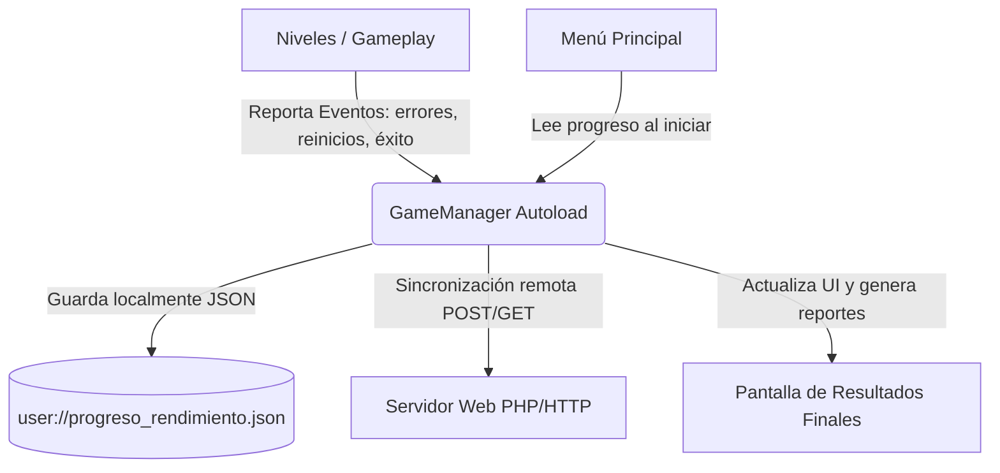

# Documentación Técnica del Proyecto: Ulearn

Ulearn es un videojuego educativo e interactivo desarrollado en **Godot Engine 4.x** enfocado en la enseñanza práctica de conceptos fundamentales de la **Ingeniería en Computación e Informática**. A través de cuatro fases temáticas compuestas por 14 niveles, el juego evalúa y registra el progreso, la eficiencia y la capacidad de resolución de problemas del usuario en tiempo real.

---

## 1. Arquitectura General y Flujo del Sistema

El juego está diseñado siguiendo un patrón desacoplado, donde la lógica de gameplay de cada nivel se mantiene independiente del almacenamiento de progreso y la gestión de métricas.

### Componentes Clave:
*   **`GameManager.gd` (Autoload / Singleton):** Es el núcleo lógico y de persistencia. Se encarga de rastrear el tiempo, calcular penalizaciones, evaluar el rendimiento del usuario mediante fórmulas matemáticas específicas y sincronizar los datos tanto de forma local (`user://`) como remota (mediante solicitudes HTTP a un backend).
*   **`DialogueManager` (Autoload / Plugin):** Gestiona los diálogos introductorios y narrativos de los niveles para contextualizar los desafíos técnicos.
*   **Interfaz de Usuario (`Meu_UI/`):**
    *   `menu_ui.tscn` / `Menu_UI.gd`: Gestiona la carga de la partida y redirige al usuario a su nivel actual o a los resultados.
    *   `final_results.tscn` / `FinalResults.gd`: Construye dinámicamente reportes detallados y tablas de rendimiento por nivel, fase y resumen global.

---

## 2. Detalle de las Fases Educativas

### Fase 1: Introducción a la Programación (Robot)
*   **Escenas:** `Compu_nv_1.tscn`, `Compu_nv_2.tscn`, `Compu_nv_3.tscn`
*   **Concepto Pedagógico:** Lógica algorítmica, secuenciación, condicionales y control de flujo.
*   **Dinámica:** El jugador controla un robot (`robot_player.gd`) en un entorno de cuadrícula con obstáculos. Debe programar la secuencia de movimientos óptima para recoger llaves, desbloquear puertas (`Bloque_Cerrado.tscn`) y alcanzar la meta (`Meta.gd`).

### Fase 2: Circuitos y Compuertas Lógicas (Circuitos)
*   **Escenas:** `Circuit_nv_4.tscn`, `Circuit_nv_5.tscn`, `Circuit_nv_6.tscn`
*   **Concepto Pedagógico:** Álgebra booleana, electrónica digital básica y lógica de compuertas.
*   **Dinámica:** Utilizando compuertas lógicas (`AND_Gate`, `OR_Gate`, `NOT_Gate`), fuentes de energía (`Fuente.gd`) y cables interconectores, el jugador debe enrutar señales de corriente para satisfacer las condiciones lógicas de los nodos receptores (`PC.gd`).

### Fase 3: Modelado de Bases de Datos (Bases de Datos)
*   **Escenas:** `BD_nv_7.tscn`, `BD_nv_8.tscn`, `BD_nv_9.tscn`
*   **Concepto Pedagógico:** Diseño relacional, categorización de entidades, definición de roles/permisos y claves primarias/foráneas.
*   **Dinámica:** El jugador interactúa con interfaces de tablas (`tabla.gd`) donde debe estructurar colecciones de datos, relacionar registros mediante llaves conceptuales y clasificar información para asegurar la integridad de la base de datos simulada.

### Fase 4: Redes y Telecomunicaciones (EcoTech)
*   **Escenas:** `nivel_4_1_10.tscn` a `nivel_4_5_14.tscn`
*   **Concepto Pedagógico:** Topología de redes, direccionamiento IP, enrutamiento, prevención de colisiones/saturación y redundancia de infraestructura.
*   **Dinámica:** Coordinado por `network_manager.gd`, el jugador debe construir enlaces físicos y lógicos entre terminales (PCs, Switches, Routers, Servidores) para enviar paquetes de datos. Debe optimizar las rutas para evitar congestión de puertos y caídas de servicio.

---

## 3. Sistema de Guardado y Métricas de Rendimiento

El rendimiento del jugador en cada nivel se calcula utilizando una escala base de **100 puntos**, la cual disminuye en función del tiempo transcurrido y las penalizaciones por fallos.

### Constantes de Penalización:
*   **Error genérico:** -6.0 pts (`PENALIZACION_ERROR`)
*   **Intento fallido de nivel:** -8.0 pts (`PENALIZACION_INTENTO`)
*   **Reinicio completo de nivel:** -10.0 pts (`PENALIZACION_REINICIO`)
*   **Fallo en botón de validación:** -5.0 pts (`PENALIZACION_VALIDACION`)
*   **Solicitud de pista:** -2.0 pts (`PENALIZACION_PISTA`)
*   **Acción incorrecta o conexión inválida:** -4.0 pts (`PENALIZACION_ACCION_INCORRECTA`)

### Fórmulas del Sistema:
1.  **Eficiencia de Tiempo:**
    $$\text{Eficiencia} = \frac{\text{Tiempo Objetivo}}{\max(\text{Tiempo Objetivo}, \text{Tiempo Usado})}$$
2.  **Penalización por Tiempo:**
    $$\text{Penalización Tiempo} = (1.0 - \text{Eficiencia}) \times 25.0$$
3.  **Tasa de Éxito:**
    $$\text{Tasa de Éxito} = \frac{1.0}{\text{Intentos Fallidos} + 1}$$
4.  **Cálculo de Puntaje de Nivel:**
    $$\text{Puntaje} = \max(0, 100 - \text{Penalización Tiempo} - \text{Penalización Errores} - \text{Penalización Reintentos})$$

### Rango y Clasificación Final:
El puntaje global pondera un **70% el promedio de los niveles** y un **30% el promedio de las fases**:
$$\text{Puntaje Global} = (\text{Promedio Niveles} \times 0.7) + (\text{Promedio Fases} \times 0.3)$$

*   **95 a 100:** Experto
*   **85 a 94.99:** Avanzado
*   **70 a 84.99:** Intermedio
*   **60 a 69.99:** Principiante
*   **Menos de 60:** Necesita mejorar

### Sincronización Remota (Opcional):
Si hay conexión disponible con el servidor PHP configurado en `GameManager.servidor`, el progreso se guarda enviando un payload en formato JSON mediante un método HTTP POST a `guardar_progreso.php`. Al iniciar, se intenta recuperar el progreso remoto mediante `obtener_progreso.php?usuario=nombre` y se fusiona inteligentemente con el archivo local `user://progreso_rendimiento.json`.
